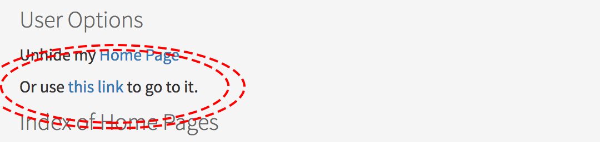

# Activating your personal Geosciences homepage

1. Head to the [GeoSciences Homepage directory](https://www.geos.ed.ac.uk/homes)
2. Login with EASE, the link is at the bottom of the page.
3. Return to the [GeoSciences Homepage directory](https://www.geos.ed.ac.uk/homes) and click "Create Link" to activate your page. Your page is now activated.
4. Go to your page by clicking by clicking the link in "Or use this link to go to it"

  

