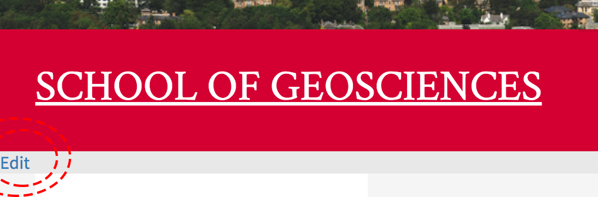

# Editing your personal GeoSciences homepage 

If you have activated your GeoSciences homepage, you can go to it via `https://www.geos.ed.ac.uk/homes/s1234567`, replacing `s1234567` with your student number.

If you aren't logged in, login with EASE (link at the bottom of the page), then click the "Edit" link just under the "School of GeoSciences" banner:

<center>  </center>

Then click "Edit: Page" in the orange menu.

This should bring up a page with a text box where you can add HTML markup to build your page. Keep it simple, with text, links and images. 

You can upload images by going back to the page with the orange menu and clicking Image in the orange Menu. Then you can upload an image, giving it a filename. Use this filename as the `src=` and `title=` in the HTML markup editing box to insert the image. Here is an example of some HTML markup which produces a simple homepage:

```html
<h1>Charles Darwin</h1>

<div>
    <p style="float: left; padding-right: 5px;"></p> 
    <p>I am a PhD student in the School of GeoSciences, where I study plant biodiversity.</p>
    <p>I write website copy intermittently for <a href="https://www.myed.ed.ac.uk" target="_blank">Agricology</a>.</p>
    <p>I sometimes help to run workshops and write online material for <a href="https://ourcodingclub.github.io/" target="_blank">Coding Club</a>.</p>
</div>
<br>
<br>
<div>
    <p>ORCID ID: <a href="https://orcid.org/" target="_blank">/255X</a> </p>
    <p><a href="https://www.researchgate.net/profile/" target="_blank">ResearchGate</a></p>
    <p><a href="https://www.geos.ed.ac.uk/people/person.html?indv=" target="_blank">Contact details</a></p>
</div>


<h3>Publications</h3>
```

When you are finished just click "Save" and "Close".

You may need to return to `https://www.geos.ed.ac.uk/homes/` in order to unhide your page by clicking "Unhide my Home Page".
